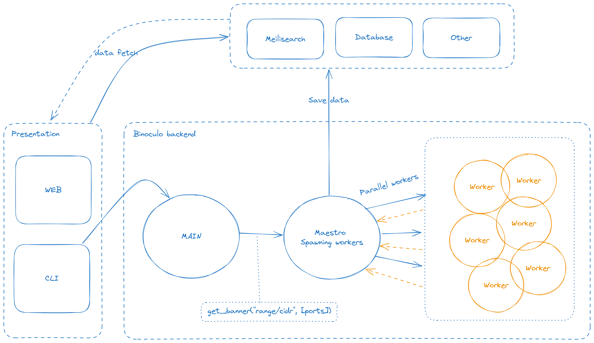

[](https://coveralls.io/github/girorme/binoculo?branch=main)
[](https://github.com/girorme/binoculo-daemon/blob/main/LICENSE)


Binoculo is a lightning-fast banner grabbing tool built with Elixir, designed to swiftly retrieve service banners from target hosts. With its high-speed functionality, Binoculo efficiently collects service information across multiple ports, aiding in network reconnaissance and analysis.

## Requirements
- Docker
- Optional: Elixir to run via your host machine

## Features
Fast Network Scanning
> Utilize the enhanced multi-process task functionality in Binoculo for rapid network scans. Leverage concurrent processing to swiftly gather information across numerous hosts and ports, providing quick insights into your network's services.

Search engines Integration
> Seamlessly integrate Binoculo with Meilisearch (current), enabling lightning-fast search capabilities over your scan results. Index and query your collected data with Meilisearch's powerful search engine, enabling efficient retrieval of network service information.

Specific Banner Searches
> Perform targeted searches for specific service banners. Refine your queries to focus on precise service types or versions, streamlining your network reconnaissance efforts.

HTTP Write
> Send commands over HTTP to communicate with services and perform actions, enhancing your network exploration capabilities

## Commands
```
Binoculo: You Know, for Banner Grabbing! Version: 1.1.0
Author: Girorme <g1r0rm3@gmail.com>
A banner grabbing tool

USAGE:
    Binoculo [-v] --range host_notation --port port(s) [--output output] [--write write] [--read read]
    Binoculo --version
    Binoculo --help

FLAGS:

    -v        Verbosity level                                                                                                

OPTIONS:

    --range             CIDR or IP range: 192.168.1.0/24 or 192.168.1.0..192.168.1.255                                       
    -p, --port          Port(s) to scan: 80,443,8080 or 80-8080 or 21,80-8080                                                
    -o, --output        Output file                                                                                          
    -w, --write         Write cutom payload to socket, e.g: GET / HTTP/1.1                                                   
    -r, --read          Save only responses that match with this string, e.g: Apache                                                                                   
```

## Usage
There is a "binoculo" bash script that you can run:

- Start meilisearch container
- Start front dashboard to filter and visualize results
- Run binoculo via docker for ease of use

**The command below runs via docker**
```
$ ./binoculo -r 192.168.101.1/24 -p 21,22 --output my_result.txt
```

Finishing the scan you can get the results via `output/my_result.txt` generated by the `--output` switch

## More features
- Write custom payload to socket (inspired by pnscan :bowtie:)
```
$ ./binoculo --range 192.168.101.1/24 -p 80 --output result.txt -w "GET / HTTP/1.1"
```

- Save only matching criteria (inspired by pnscan :bowtie:)
```
$ ./binoculo --range 192.168.101.1/24 -p 80 --output result.txt -w "HEAD / HTTP/1.1" -r "Apache"
```

### Meilisearch integration ⭐
```
$ ./binoculo --meili
```

The command above launches a meilisearch container!

_You can now access `localhost:7700` to get results via meilisearch_

**Meilisearch print**


---

## Update
To update to the latest version use the command below:

> ./binoculo -u

---
## Architecture

