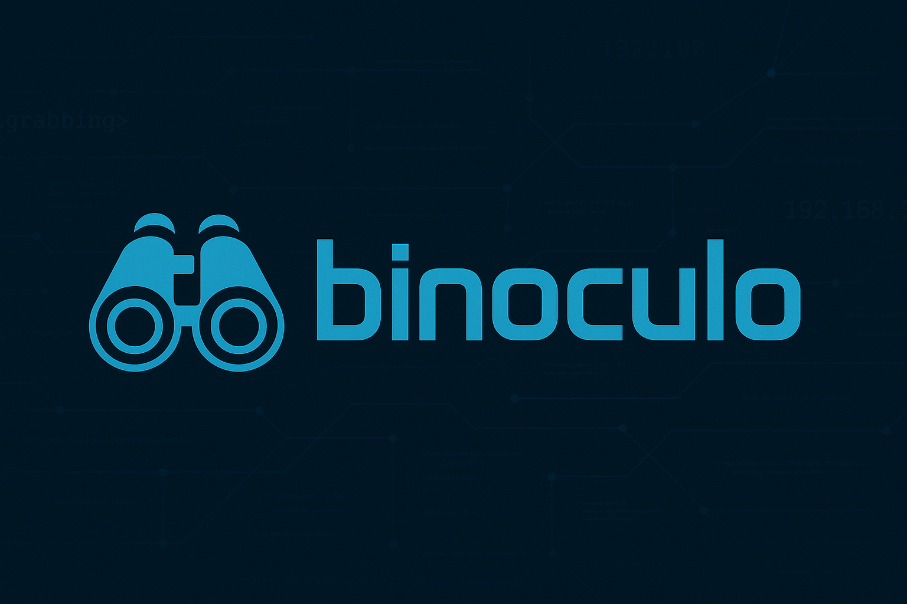

[](https://coveralls.io/github/girorme/binoculo?branch=main)
[](https://github.com/girorme/binoculo-daemon/blob/main/LICENSE)

<p align="center">
   
</p>

# Binoculo
A lightning-fast banner grabbing tool built with **Elixir**, designed to quickly retrieve service banners from target hosts. Ideal for network reconnaissance and analysis, Binoculo efficiently collects service info across multiple ports.


---

### :rocket: Features
- **Fast Network Scanning**: Leverage Elixir's concurrent processing for rapid scans across multiple hosts and ports.
- **Search Engine Integration**: Integrate with Meilisearch to index and query scan results for efficient data retrieval.
- **Specific Banner Searches**: Perform targeted searches for specific service banners or versions.
- **HTTP Write**: Send custom commands over HTTP to communicate with services and perform actions.
- **HTTP Server Mode**: Start a lightweight HTTP server to expose scan results and interact with the tool programmatically.

### Requirements
- Docker
- Optional: Elixir installed locally

---

### Quick Start
Run Binoculo easily with Docker with the `binoculo` shell script. Example:

```bash
$ ./binoculo -r 192.168.101.1/24 -p 21,22 --output my_result.txt
```

Results will be saved in output/my_result.txt.

---

### Example Commands
Basic Usage:

> In addition to saving the results with --output, you can use meilisearch/dashboard to store and visualize the results. ([meilisearch integration](#Meilisearch-Integration))

```bash
Binoculo: You Know, for Banner Grabbing! Version: 1.3.0

USAGE:
    Binoculo --range <host_notation> --port <port(s)> [--output <file>] [--write <payload>] [--read <criteria>]
```

Range of ports:
```bash
$ ./binoculo --range 192.168.101.1/24 --port 21,22,3301
$ ./binoculo --range 192.168.101.1/24 --port 8080-8082,9000
```

Write Custom Payload:
```bash
$ ./binoculo --range 192.168.101.1/24 -p 80 --output result.txt -w "GET / HTTP/1.1"
```

Save Only Matching Criteria:
```bash
$ ./binoculo --range 192.168.101.1/24 -p 80 --output result.txt -w "HEAD / HTTP/1.1" -r "Apache"
```

### Meilisearch Integration

```bash
$ ./binoculo --dashboard
```

View results in your browser at `localhost:3000`

This command launches Meilisearch along with a dashboard where you can view your scan results. The results are displayed in a faceted manner, making it easier to search and filter through the collected data. Faceted search allows you to narrow down your results based on various categories, providing an efficient way to explore your network scans.


#### Using Meilisearch Endpoints

In addition to the dashboard, you can also interact with Meilisearch (`localhost:7700`) directly via its API endpoints to perform searches. The scan results are indexed under the `hosts` index, allowing you to make custom queries and retrieve data without needing to use the dashboard interface. This gives you the flexibility to integrate Binoculo with other systems or tools that can consume the Meilisearch API for advanced searching and filtering.

### Http server:

```bash
$ ./binoculo --server
```

This command starts an HTTP server on port `4000`, allowing you to interact with Binoculo via a REST API. The server exposes endpoints to retrieve scan results

Once the HTTP server is running, you can interact with it using the following endpoints:

- **POST /scan**: Trigger a new scan by sending a JSON payload with the scan parameters:
  ```json
  {
    "host_notation": "192.168.101.1/24",
    "ports": "21,22,80",
    "read": "GET / HTTP/1.1"
  }
  ```

Example usage with `curl`:
```bash
$ curl -X POST http://localhost:4000/scan -H "Content-Type: application/json" -d '{"host_notation":"192.168.101.1/24","ports":"80"}'
```

---

### Update Binoculo

Keep Binoculo up to date:
```bash
$ ./binoculo -u
```

### Architecture


This tool was inspired by the speed and simplicity of pnscan, but built with the power of Elixir to take banner grabbing to the next level!

```
MIT License

Copyright (c) 2023 Girorme

Permission is hereby granted, free of charge, to any person obtaining a copy
of this software and associated documentation files (the "Software"), to deal
in the Software without restriction, including without limitation the rights
to use, copy, modify, merge, publish, distribute, sublicense, and/or sell
copies of the Software, and to permit persons to whom the Software is
furnished to do so, subject to the following conditions:

The above copyright notice and this permission notice shall be included in all
copies or substantial portions of the Software.

THE SOFTWARE IS PROVIDED "AS IS", WITHOUT WARRANTY OF ANY KIND, EXPRESS OR
IMPLIED, INCLUDING BUT NOT LIMITED TO THE WARRANTIES OF MERCHANTABILITY,
FITNESS FOR A PARTICULAR PURPOSE AND NONINFRINGEMENT. IN NO EVENT SHALL THE
AUTHORS OR COPYRIGHT HOLDERS BE LIABLE FOR ANY CLAIM, DAMAGES OR OTHER
LIABILITY, WHETHER IN AN ACTION OF CONTRACT, TORT OR OTHERWISE, ARISING FROM,
OUT OF OR IN CONN
```
